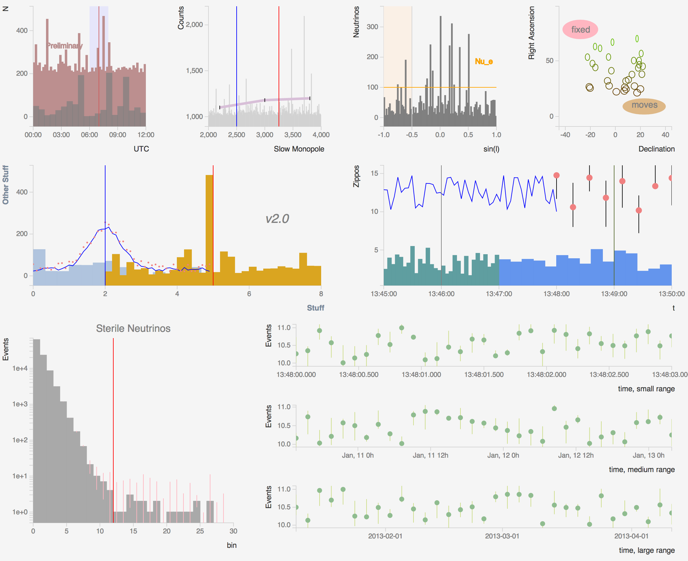

i3d3
====

[D3](http://d3js.org/)-based histogramming and plotting library (for use in [IceCube](http://icecube.wisc.edu) and other projects).  **This is a work in progress**.

### Examples

The following examples were all created from [this HTML](example.html):

### Background

We looked around at 
[quite](https://code.google.com/p/flot/)
[a](http://www.jqplot.com/tests/) 
[few](http://www.highcharts.com/)
JavaScript plotting libraries which might meet our requirements, which
are (watch this space for updated status as the project progresses):

#### DONE

- High graphical signal/noise ratio
- Histograms / bar graphs based on provided array of bin heights
- Set color, transparency of histogram
- Scatter plots
- Line graphs
- Display X and Y axes, with labels
- Multiple graphs/histograms per plot
- Add rectangular highlights to X-ranges under plot
- Draw horizontal, vertical and other lines on top of plots
- Add text to plot in either data or display units
- Wrap everything in an object to avoid namespace pollution

#### Not done

- Time series X-axes
- Log / linear axes
- Error bars
- Show gaps in data
- Show (x,y) plot coordinates of mouse [?]
- Zooming / panning
- Exporting data from plot
- Exporting plot graphic (either SVG or PDF would be OK)
- Ability to “reset” the plot (if, for example, zoomed beyond recognition)

None of the canned plotting / graphing packages we looked at were
quite what we wanted; D3.js does not provide these directly but is
sufficiently powerful, flexible and fast to provide a foundation to
allow us to implement these ourselves.

### References

http://stackoverflow.com/questions/6766547/javascript-graphing-library

http://www.amazon.com/Interactive-Data-Visualization-Scott-Murray/dp/1449339735/ref=pd_sim_b_1

### Author

[John Jacobsen](http://eigenhombre.com)
