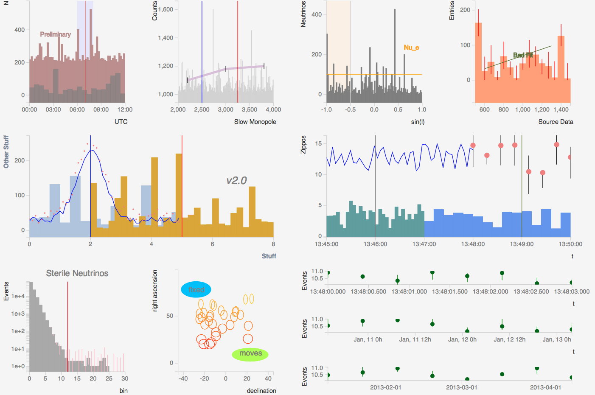

i3d3
====

[D3](http://d3js.org/)-based histogramming and plotting library, for
use in [IceCube](http://icecube.wisc.edu) and other projects.

**This is a work in progress**.

We looked around at 
[quite](https://code.google.com/p/flot/)
[a](http://www.jqplot.com/tests/) 
[few](http://www.highcharts.com/)
JavaScript 
plotting
libraries
to meet
our requirements, which are:

#### DONE

- Minimal visual noise
- Make histograms / bar charts based on provided array of bins
    - Display X and Y axes
    - Show X and Y axis labels
    - Single or multiple plots per page, of various sizes
    - Draw horizontal and vertical lines on top of plot
    - Add rectangular regions on top of plot

#### Not done

- Support line plots, scatter plots
- Show gaps in data
- Error bars
- Add text to plot
- Zooming - in JavaScript with available points
- Panning - same question
- Exporting data from plot
- Exporting plot graphic (SVG or PDF)
- Ability to “reset” the plot (if, for example, zoomed beyond recognition)
- Switch y-axis to logarithmic
- Show (x,y) plot coordinates of mouse
- Plot results of a fit overlaid with the histogram (i.e. gaussian over SPE fit)

None of the canned plotting / graphing packages we looked at were
quite what we wanted; D3.js does not provide these directly but is
sufficiently powerful, flexible and fast to provide a foundation to
allow us to implement these ourselves.

#### Example

The following output was created from [this simple HTML](example.html):

#### References

http://stackoverflow.com/questions/6766547/javascript-graphing-library

http://www.amazon.com/Interactive-Data-Visualization-Scott-Murray/dp/1449339735/ref=pd_sim_b_1
